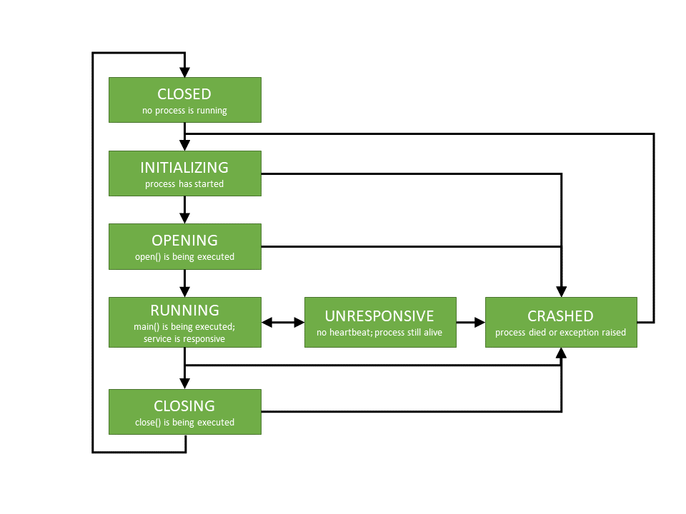

Services
========

Using a service
---------------

To use a service, you need to have a ``TestbedProxy`` instance that is connected to the testbed server. You can then access
the service as an attribute of the testbed proxy, using the service ID, as defined in the configuration file, as the attribute name.
For example, if you have a service with the service ID ``science_camera``, you can access it through its proxy as follows:

.. code-block:: python

    from catkit2 import TestbedProxy

    testbed = TestbedProxy('127.0.0.1', 1234)
    science_camera = testbed.science_camera

where the port number is replaced by the correct value of your testbed server. Alternatively, you can use the ``get_service()`` method of the testbed proxy:

.. code-block:: python

    science_camera = testbed.get_service('science_camera')

The service proxy will automatically start the service as soon as you try to access one of its attributes (property, command or datastream) if it is not already running, and will raise an exception if the
service has crashed or is in failsafe mode. You can then use the service proxy to call methods, or access properties and
datastreams of the service as usual.

Service configuration
---------------------

Each service to be used with a testbed needs its own entry in the configuration file ``services.yml``. The config entry
of each service contains two blocks:

- The **general** setup block
- The **service-specific** parameter block

The **service-specific** parameter block contains any parameters specific to the service in question.

The **general** setup block contains four standardized entries, although not all of them are mandatory:

    - `service_type`
    - `simulated_service_type`
    - `interface`
    - `requires_safety`

An example for such a general setup block, in this case for a camera, is given here:

.. code-block:: YAML

    science_camera:
      service_type: zwo_camera
      simulated_service_type: camera_sim
      interface: camera
      requires_safety: false

      ... # -> specific parameter block

The "name" of a service, in the above example ``science_camera``, is called the ``service_id`` and needs to be unique
across all services. You can however have several services use the same ``service_type``. For example, you can have three camera serviced with
``service_ids`` ``cam1``, ``cam2`` and ``cam3`` all using ``service_type: zwo_camera``, but you cannot duplicate service IDs.

You can find example service configurations for each service type in the documentation of the built-in services.

.. note::
    The config keys ``service_type`` and ``requires_safety`` are mandatory, the others are not. You need at least the ``service_type`` when running on hardware, which will be interpreted as the simulated service type when running in simulated mode if the latter hasn’t been set explicitly. The ``interface`` (service proxy) is optional.

The key ``requires_safety`` is a simple boolean that defines whether safety is checked while the service is running, and
whether changes in the safety reports will influence the running service.

The key ``simulated_service_type`` designates which service is used when running the testbed in simulated mode.
Simulated services are also "just" services, implemented in the same way. The crucial difference is that they do not
talk to hardware and instead talk to the testbed simulator service stored in the object ``self.testbed.simulator``.
The simulator holds an instance of the optical model, saved in ``self.model``.

The key ``interface`` specifies which service proxy is used for a service. This key is optional. If not set, a default service proxy class will be used.

Launching and debugging a service
---------------------------------

Services can be started both by the ``Testbed`` upon requests from a ``TestbedProxy``, or manually from the command line. The
latter might be advantageous when debugging a service since not all the output of a service is logged. Services implemented in Python can be
started manually from the command line using :

.. code-block:: bash

    python service_type.py --id <service_id> --port <service_port> --testbed_port <testbed_port>

for the science camera this would look like:

.. code-block:: bash

    python zwo_camera.py --id science_camera --port 1235 --testbed_port 1234

Note that the service port here is arbitrary (more discussion later).

C++ services can also be started manually from the command line using:

.. code-block:: bash

    service_type.exe --id <service_id> --port <service_port> --tesbed_port <testbed_port>

where ``<service_id>`` and ``<testbed_port>`` are replaced by their correct values, ``<service_port>`` is arbitrary. Services will
register themselves with the testbed. After registration, you can use them from any TestbedProxy as usual. Note that
even in this case, the ``service_id`` needs to be an entry in the ``services.yml`` configuration file. Otherwise, the
testbed does not have a configuration to provide to the service. Services running in the terminal can be interrupted
using Ctrl+C, or by stopping them using a separate TestbedProxy or ServiceProxy.

Service state
-------------

The state of the service is managed by the testbed and the service. It keeps track of what the service is currently doing. The service states are:

* *Closed*. No process for this service is running.
* *Initializing*. A process has been started, but it's still initializing and has not started opening the service yet.
* *Opening*. The ``open()`` method is being called and the connections with hardware or other services are being established.
* *Running*. The service is operational, the ``main()`` function is being called and the service is responding to requests on its server.
* *Closing*. The ``close()`` method is being called and the service is being shut down safely.
* *Unresponsive*. The service process has stopped sending heartbeats, but is still running.
* *Crashed*. The service has crashed. The service may have raised an exception during its operation or may have crashed outright without shutting down safely.
* *Fail_safe*. The service was safely closed because of safety violations.

The allowed transitions for a service state are displayed in the below diagram.

Handling a service
------------------

You can check the state of a service in the following way:

.. code-block:: python

    print(testbed.science_camera.state)
    print(testbed.science_camera.is_running)  # whether the service state is RUNNING
    print(testbed.science_camera.is_alive)  # whether the service state is any of the alive states (ie. not CRASHED, FAIL_SAFE or CLOSED)

For stopping and starting a service:

.. code-block:: python

    testbed.science_camera.stop()
    testbed.science_camera.start()

A service is also started automatically if you try to access an attribute (property or command or datastream) on a service.
If the service has crashed, or is in failsafe mode, then the service will refuse to start by itself or via the service
proxy alone. This is to avoid an infinite loop of the service crashing and restarting, which is undesired.
Instead, you can ask the testbed server to start a `CRASHED`/`FAIL_SAFE`/`CLOSED` service:

.. code-block:: python

    testbed.start_service('science_camera')

Creating your own service
-------------------------

File structure and file naming for services
~~~~~~~~~~~~~~~~~~~~~~~~~~~~~~~~~~~~~~~~~~~

Create a folder under ``services/`` named for your service. Add a Python module with the same name. The service class
inside the module should use the same name but in CamelCase, see also next section.
Also create a simulated-service folder using the same base name with the suffix ``_sim``.
Add a proxy module for the service in ``testbed/proxies/`` (named after the service), and create a documentation page under `docs/` for the service; include that page in `index.rst`.

::
   Example:

   services/
    ├── my_service/
    │   ├── my_service.py  # service implementation
    ├── my_service_sim/
    │   ├── my_service_sim.py  # simulated service implementation
   testbed/
    ├── proxies/
    │   ├── my_service.py  # service proxy implementation

Services and service proxies can also be defined outside of catkit2 if there is a more specific or new need.

.. note::

   No matter where a service and/or proxy is defined, they need to be added to the entry points in the ``pyproject.toml`` file of
   catkit2, so that they can be found by the testbed server and testbed proxy.

Service implementation
~~~~~~~~~~~~~~~~~~~~~~

Each service is contained in its own module, and is implemented as a class. The name of the class can be arbitrary, but
it is recommended to use the same name as the service type in CamelCase. For example, if your service type is ``my_service``,
then the service class should be named ``MyService``. The same applies to the simulated service, which should be named ``MyServiceSim`` in this case.

.. note::

   - Services inherit from ``Service``
   - Simulated services inherit from ``Service``
   - Service proxies inherit from ``ServiceProxy``

When implementing a service, you need to implement at least the following methods:
- ``init()``: Called when the service process is started. Contains all the code that is needed to initialize the service. For example, this includes reading any variables from the service configuration that are needed for the service to run.
- ``open()``: Called when the service is started. Contains all the code that is needed to start the service and make it operational. For example, this includes establishing connections with hardware or other services, and starting any threads that are needed for the service to run.
- ``main()``: Called when the service is running. Contains all the code that is needed to keep the service running.
- ``close()``: Called when the service is stopped. Contains all the code that is needed to safely shut down the service. For example, this includes closing connections with hardware or other services, and stopping any threads that were started in the ``open()`` method.

At the end of a service file, you need to add the following code to allow the service to be started:

.. code-block:: python

    if __name__ == "__main__":
        service = MyService()  # replace with the name of your service class
        service.run()

Example implementation
~~~~~~~~~~~~~~~~~~~~~~

A good examples of a previously implemented service: `Physik Stage Controller <https://github.com/spacetelescope/catkit2/pull/401>`_
