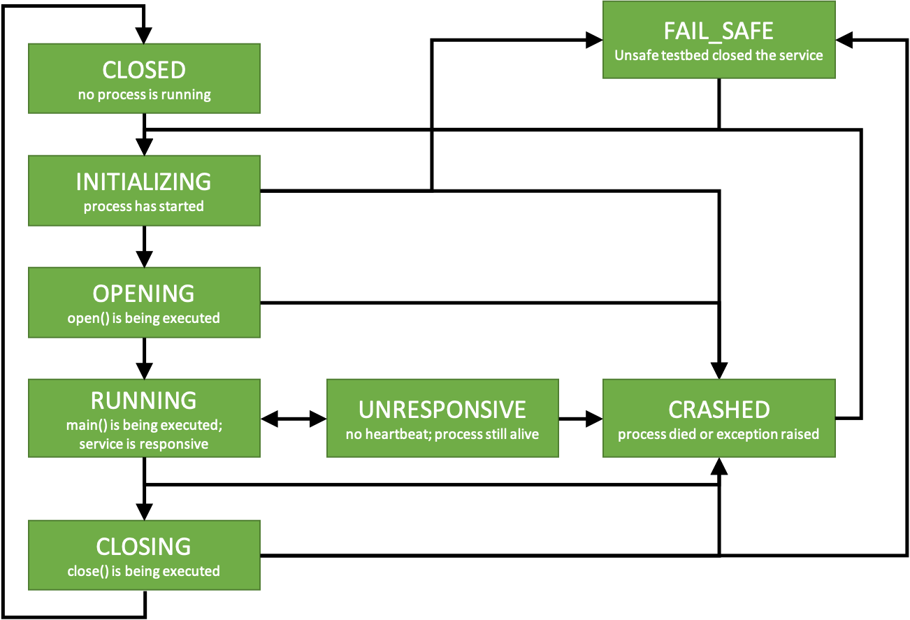

Services
========

File structure and launching
----------------------------

All services have an associated service type. This service type corresponds to a directory, containing all the code used to run that specific service. This can be either a Python script (named ``<service_type>.py``), or a fully compiled binary application (named ``<service_type>.exe`` or ``<service_type>``).

To start a service, you need to know its name. The service name corresponds to an entry in the ``services.yml`` configuration file. Inside this configuration entry, there should be a key ``service_type``. The service type should correspond to a directory in one of the service paths that were passed to the server upon startup.

Service state
-------------

The state of the service is managed by the testbed and the service. It keeps track of what the service is currently doing. The service states are:

* *Closed*. This means that no process for this service is running.
* *Initializing*. This means that a process has been started, but it's still initializing and has not started opening the service yet.
* *Opening*. This means that the `open()` method is being called and that connections with hardware or other services are being established.
* *Running*. This means that the service is operational, the `main()` functions is being called and that the service is responding to requests on its server.
* *Closing*. This means that the `close()` method is being called and that the service is being shut down safely.
* *Unresponsive*. This means that the service process has stopped sending heartbeats, but is still running.
* *Crashed*. This means that the service has crashed. The service may have raised an exception during its operation or may have crashed outright without even shutting down safely.
* *Fail_safe*. This means that the service was safely closed because of safety violations. 

The allowed transitions for a service state are displayed in the below diagram.



Creating your own service
-------------------------

Debugging a service
-------------------

Services can be started both by the Testbed upon requests from a TestbedProxy, or manually from the command line. The latter might be advantageous when debugging a service since not all the output of a service is logged. Services can be started manually from the command line using

```
python service_type.py --id <service_id> --port <service_port> --tesbed_port <testbed_port>
```

or

```
service_type.exe --id <service_id> --port <service_port> --tesbed_port <testbed_port>
```

where `<service_id>`, `<service_port>` and `<testbed_port>` are replaced by their correct values. Services will register themselves with the testbed. After registration, you can use them from any TestbedProxy as usual. Note that even in this case, the `service_id` needs to be an entry in the `services.yml` configuration file. Otherwise, the testbed does not have a configuration to provide to the service. Services running in the terminal can be interrupted using Ctrl+C, or by stopping them using a separate TestbedProxy or ServiceProxy.
