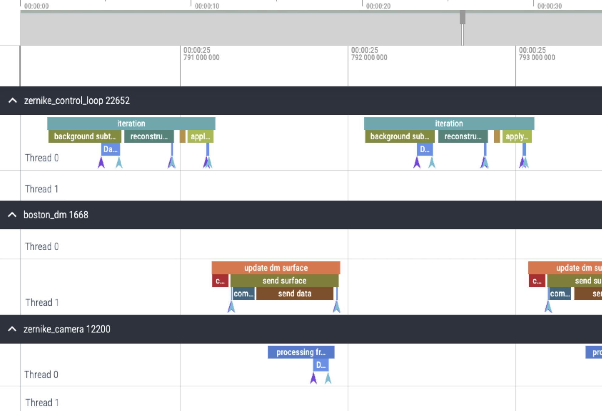

# Summary

CATKit2 (Control and Automation for Testbeds Kit 2) is a high-performance software framework designed for controlling complex laboratory hardware systems. Developed primarily for adaptive optics and high-contrast imaging testbeds in astronomy, it provides a robust infrastructure for hardware synchronization, real-time data streaming, and distributed process management. The framework enables researchers to orchestrate multiple hardware devices -— such as cameras, deformable mirrors (DMs), motorized stages, light sources, and sensors —- into cohesive, synchronized experimental setups.

The software employs a service-oriented architecture where each hardware device or computational task runs as an independent service process. Services communicate through high-speed, low-latency data streams implemented via shared memory, enabling real-time data exchange between components with minimal overhead. A central testbed server manages service lifecycle, configuration distribution, and provides service discovery. The framework supports both hardware operation and comprehensive simulation modes, allowing researchers to develop and test control algorithms without physical hardware.

CATKit2 is written in C++ for performance-critical operations with Python bindings for ease of use. It includes over 40 ready-to-use service implementations covering cameras (ZWO, FLIR, Hamamatsu, Allied Vision), DMs (Boston Micromachines), motion controllers (Newport, Thorlabs), spectrometers (Ocean Optics), and various other laboratory instruments. Each hardware service has a corresponding simulator, enabling full software-in-the-loop testing and algorithm development.

# Statement of need

Modern astronomical instrumentation relies increasingly on sophisticated laboratory testbeds to develop and validate technologies before deployment to observatories. These testbeds, such as the High-contrast Imager for Complex Apertures Telescopes (HiCAT) [@hicat] testbed at the Space Telescope Science Institute, require precise coordination of numerous hardware components operating at high speeds with strict timing requirements. Control frameworks must handle diverse hardware interfaces while maintaining microsecond-level synchronization and gigabyte-per-second data throughput.

Existing general-purpose laboratory automation tools often prioritize flexibility over performance, resulting in latency and jitter that are unacceptable for adaptive optics and wavefront sensing applications. Conversely, specialized control systems developed for specific instruments or testbeds typically lack the modularity and extensibility needed for multi-purpose testbeds. There is a need for a framework that bridges this gap: providing both the performance required for real-time control loops and the flexibility to accommodate diverse hardware configurations.

CATKit2 addresses this need by combining a high-performance C++ core optimized for shared-memory data streaming with Python service implementations that enable rapid prototyping and integration with the scientific Python ecosystem. The framework's design prioritizes concurrent operation, allowing multiple processes to access streaming data simultaneously with minimal overhead. This architecture is particularly valuable for high-contrast imaging experiments where wavefront sensors must provide real-time feedback to deformable mirrors while data is simultaneously logged and visualized.

# State of the field

Several frameworks exist for laboratory hardware control, each with distinct design goals that influence their suitability for high-performance testbed applications. At the large-scale facility level, the Experimental Physics and Industrial Control System (EPICS) [@epics] provides robust distributed control through channel access protocols, excelling at managing geographically distributed systems with thousands of process variables. Tango Controls [@tango] offers similar capabilities with CORBA-based middleware. However, both frameworks prioritize network transparency and distributed operation, which introduces latency that can be problematic for high-speed feedback loops requiring microsecond-level response times.

For laboratory-scale Python-based instrumentation, PyMoDAQ [@pymodaq] provides a modular approach to hardware control with a graphical user interface for experiment orchestration. While PyMoDAQ excels at general laboratory automation and data acquisition workflows, it is primarily designed for sequential measurement procedures rather than continuous high-speed feedback control. Its architecture focuses on scanner-based acquisition patterns, which differs fundamentally from the continuous streaming model required for adaptive optics and real-time control applications.

In the specific domain of astronomical adaptive optics, CACAO [@cacao] provides a high-performance real-time control system implementing efficient shared-memory data streams optimized for low-latency wavefront sensing and DM control. However, CACAO is tightly coupled to Linux-based real-time kernels and lacks cross-platform support, limiting its deployment flexibility. Furthermore, its focus on low-level control loops means it does not provide the instrument-level service architecture, configuration management, and hardware abstraction layers required for comprehensive testbed operation.

CATKit2 was developed to address the gap between these solutions by combining the best aspects of each approach. Compared to PyMoDAQ, CATKit2 focuses on high-speed continuous control systems with microsecond-level latency requirements rather than sequential acquisition workflows. Its service-oriented architecture provides process isolation and fault tolerance critical for long-running experiments. Compared to CACAO, CATKit2 provides comprehensive instrument-level system design with modular services for diverse hardware types, unified configuration management, and cross-platform support for Windows, Linux, and macOS. The integrated simulation framework enables software-in-the-loop testing on any supported platform, facilitating collaborative development across institutions with different computing environments.

# Software design

The architecture of CATKit2 reflects careful trade-offs between performance, modularity, and ease of use. At the core of the system is the DataStream, a fixed-size circular buffer residing in shared memory that enables zero-copy data exchange between processes. DataFrames submitted to a DataStream receive unique identifiers and timestamps, enabling deterministic ordering and latency measurements. This design choice is critical for performance: because data resides in shared memory, multiple clients can access streaming data without involving the server process, eliminating the bottlenecks inherent in client-server architectures.

CATKit2 implements a service-oriented architecture where each hardware device or computational task runs as an independent process. This provides fault isolation —- if one service crashes, others continue operating. The testbed server manages service dependencies and ensures that services start and stop in the correct order. Each service exposes a consistent API consisting of properties (typed values with optional getters/setters), commands (remote procedure calls with named arguments), and data streams. This unified interface is accessible from both C++ and Python through proxy objects that hide the underlying communication complexity from users.

The communication stack employs a hybrid strategy optimized for different use cases. Protocol Buffers provide efficient binary message serialization with strong schema validation for control operations. ZeroMQ handles asynchronous request-reply and publish-subscribe messaging patterns. For high-bandwidth data streaming, the system bypasses the network stack entirely and uses shared memory directly. This combination optimizes for both low-latency control and high-throughput data transfer.

Configuration management is performed by the centralized TestbedServer, ensuring consistent views of the testbed configuration. This configuration is distributed as JSON to all services and clients. Services receive only their own configuration section, promoting encapsulation and reducing unintended cross-dependencies that can complicate maintenance.

Hardware safety is a primary concern in astronomical instruments that contain expensive or delicate hardware components. CATKit2 includes a safety monitor service which continuously checks testbed conditions. Users can declare certain services to require a safe testbed to operate. When unsafe conditions are detected or when a safe testbed environment cannot be guaranteed (i.e. when a safety sensor stops updating), these services will trigger a fail-safe mode and be shut down. After a fail-safe trigger, manual intervention is required to bring these services back up online.

The server collects custom logging and tracing information from services and forwards them on a dedicated port. In particular, on-demand custom tracing is made available in the form of unified tracing file that can be visualized by standard tools (e.g. Perfetto). Tracing of specific sections is implemented by adding a context manager around the section of the code that needs to be analyzed. Trace timing is measured at the nanosecond level and special care has been taken to make sure this contributes negligible delay to code execution.

# Research impact statement

CATKit2 has been in active development since 2022 and has been adopted by five astronomical instrumentation testbeds beyond its initial deployment on the HiCAT testbed at the Space Telescope Science Institute, where it has already een used for several research projects [@Lau2024ESCAPE-hicat-spie; @Page2025ArtificialIntelligence; @Buralli2026ImpactOfSegmentedDMs]. It also gave rise to a collaboration specific to high-contrast imaging that is based entirely on CATKit2 [@Soummer2026catkit2-hci].The list of testbeds that already deploy CATKit2 includes the Très Haute Dynamique 2 (THD2) testbed at LIRA/Observatoire de Paris [@Laginja2026THD2spie; @LandmanDoelman2026SUPPPPRESS; @Laginja2025THD2spie], the Santa Cruz Extreme AO Lab (SEAL) at University of California Santa Cruz [@Jensenclem2025SEAL], the Exoplanet Spectroscopy lab (ExoSpec) at Goddard Space Flight Center, and the High Contrast High-Resolution Spectroscopy for Segmented Telescopes Testbed (HCST) at Caltech [@DoO2026spie]. More research groups have started to adopt CATKit2 for their testbeds currently still under development [@Rai2026India; @Ahrer2026MITESI].

The modular service architecture has enabled contributions from multiple institutions, with new hardware services contributed by testbed operators at collaborating facilities. This development model has expanded the hardware support ecosystem while maintaining code quality through peer review and automated testing.

# AI usage disclosure

Generative AI tools (GitHub Copilot, Qwen3, Kimi K2.5, Claude Opus) were used for code autocompletion and code generation during software development, and for drafting sections of this manuscript. All AI-assisted outputs were reviewed, edited, and validated by the human authors, who made all core design decisions. All AI-generated code underwent the same peer review process as handwritten code, including pull request reviews and validation through automated continuous integration tests.

# Acknowledgements

The authors thank the broader HiCAT team and the Space Telescope Science Institute for supporting this development. The HiCAT testbed has been developed over the past 10 years and benefitted from the work of an extended collaboration of over 50 people. This work was supported in part by the National Aeronautics and Space Administration under Grant 80NSSC19K0120 issued through the Strategic Astrophysics Technology/Technology Demonstration for Exo-planet Missions Program (SAT-TDEM; PI: R. Soummer), and under Grant 80NSSC22K0372 issued through the Astrophysics Research and Analysis Program (APRA; PI: L. Pueyo).
E. H. Por was supported in part by the NASA Hubble Fellowship grant HST-HF2-51467.001-A awarded by the Space Telescope Science Institute, which is operated by the Association of Universities for Research in Astronomy, Incorporated, under NASA contract NAS5-26555. E.H.Por was also supported in part by a 51 Pegasi b Fellowship awarded by the Heising-Simons Foundation. S. Steiger acknowledges support by STScI Postdoctoral Fellowship and I. Laginja acknowledges partial support from a postdoctoral fellowship issued by the Centre National d’Etudes Spatiales (CNES) in France.

# References
